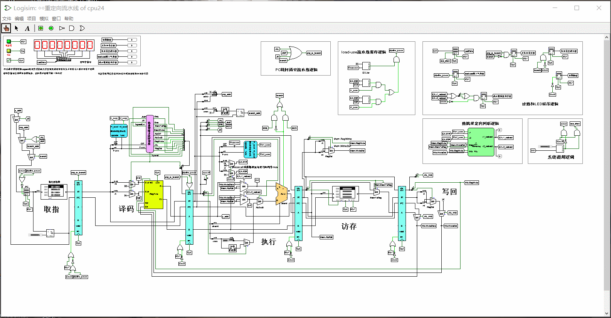
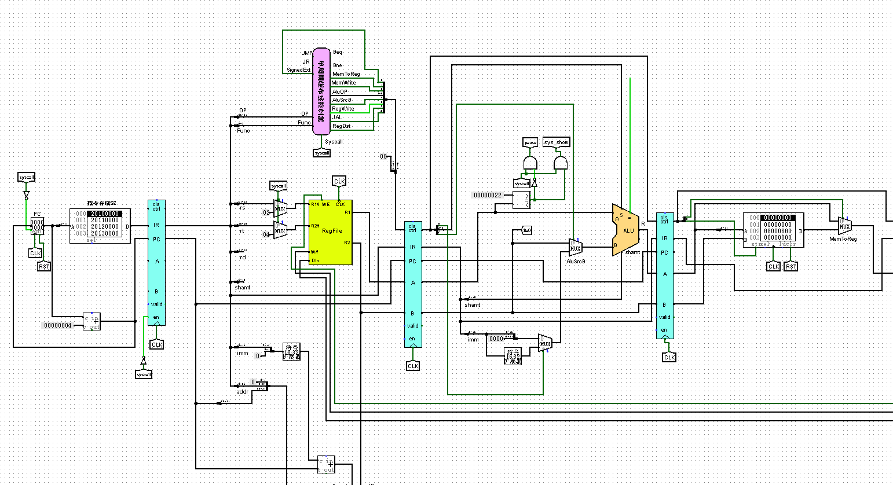
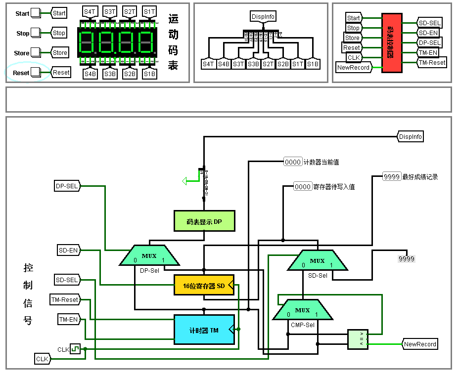

# 关于

这个仓库主要包含一个五段流水线的CPU设计实现，采用的模拟软件为[Logisim](http://www.cburch.com/logisim/)，Logisim是设计和模拟数字逻辑电路的工具。此外还包含一些用于测试的MIPS汇编文件等。汇编文件由[Mars汇编器](http://courses.missouristate.edu/kenvollmar/mars/)将MIPS汇编代码编译为二进制程序，MARS是一个轻量级的交互式开发环境(IDE)，用于MIPS汇编语言编程，旨在与Patterson和Hennessy的《计算机组成和设计》一起用于教育级别的使用。

# 演示

- 能处理分支相关和数据相关的CPU，下图为该CPU在benchmark上的实验效果

- 上面版本简化后的5段理想流水线

- 一个数字码表，使用了一个简单的有限状态机

